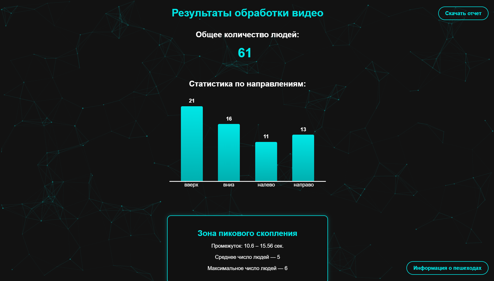
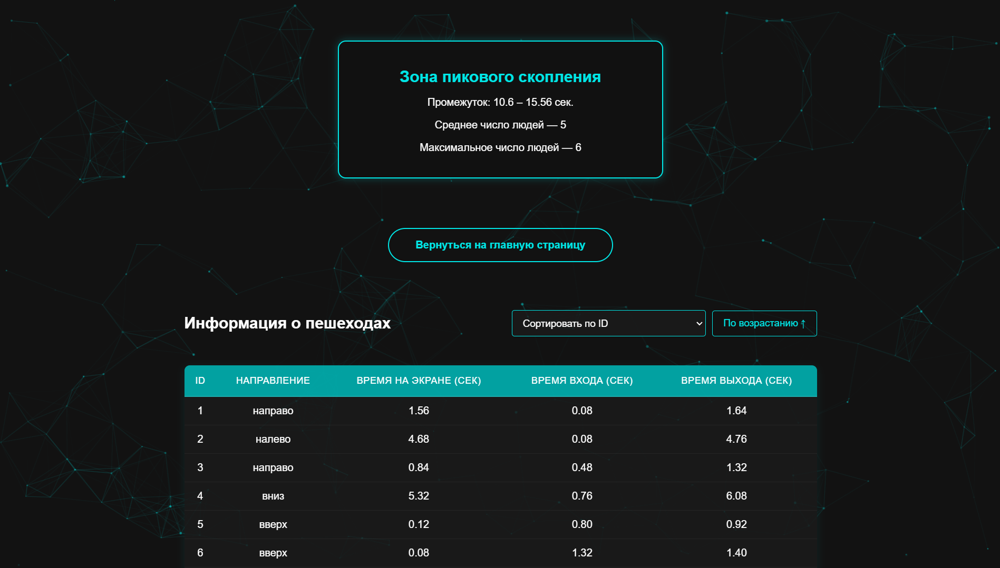
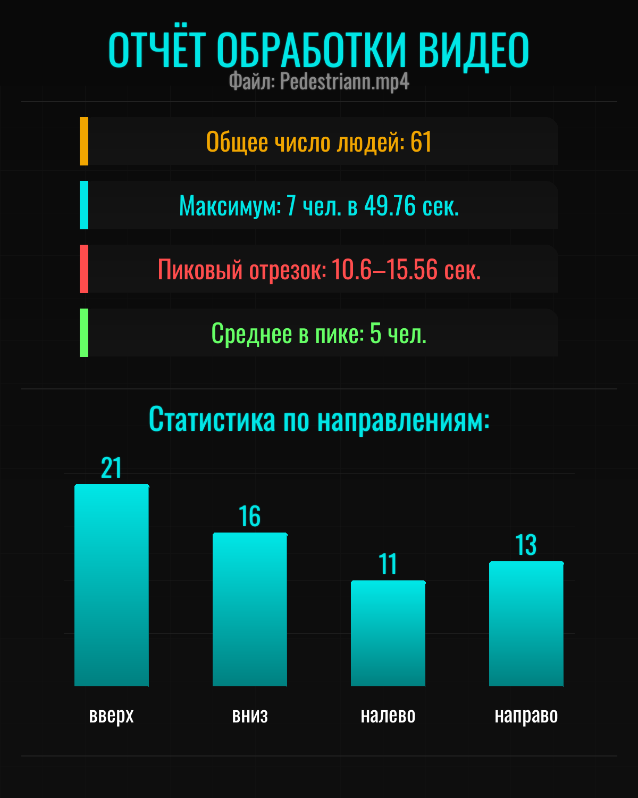

# Pedestrian Analysis

A web application for detecting and analyzing pedestrian movement in uploaded video files using YOLOv8 and Python. The system provides detailed analytics, visual charts, and an automatic image report.


## 📌 Features

- Upload any video and select a time range
- Detect and count unique people
- Track movement directions (up, down, left, right)
- Generate statistical reports and tables
- Download a stylized visual report as an image
- Telegram bot integration for video processing directly in chat
- Clean, modern UI with animated visuals


## 📦 How to use

1. Clone the repository:
    ```bash
    git clone https://github.com/nleaxy/PedestrianAnalysis.git
    cd PedestrianAnalysis
    ```

2. Activate venv and local server:
    ```bash
    python -m venv venv
    venv\Scripts\activate  # or source venv/bin/activate
    pip install -r requirements.txt
    python app.py
    ```

4. Open in your browser:
http://localhost:5000

5. Upload a video, choose time interval, press "Отправить".

6. Wait and see the results.

## 🤖 Telegram Bot Guide

1. Create a telegram bot via @BotFather

2. Paste Bot Token into BOT_TOKEN variable

3. Start the bot:
   ```bash
   python bot.py
   ```

4. Send a video to the bot.

5. Choose timecodes or send /continue to process the whole video. Get result + analysis in chat.


## 📸 Screenshots

<p align="center">
  
  
</p>

<p align="center">
  <i>Initial screen before uploading a file with some project info, and the state after a file is selected with visible time selection slider.</i>
</p>

<br/>

<p align="center">
  
  
  
</p>

<p align="center">
  <i>Processed results: total pedestrian count, movement statistics, peak density interval, and a sortable pedestrian table.</i>
</p>

<br/>

<p align="center">
  
</p>

<p align="center">
  <i>Example of an auto-generated report summarizing key data in a downloadable image: pedestrian count, movement directions, peak values, and a stylized chart section. Can be downloaded with the "Скачать отчет" button on the top right corner of results screen.</i>
</p>

<p align="center">
  
  
</p>

<p align="center">
  <i>Example of how telegram bot works.</i>
</p>

## 🔧 Technologies

- Python (Flask, Pillow, OpenCV, Ultralytics YOLOv8)
- HTML, CSS, JS (Chart.js, noUiSlider, html2canvas)
- Telegram Bot (python-telegram-bot)
- JSON for storing detection results


## 📊 Example Output

Component | Description
- output.mp4 | Final processed video with boxes
- results.json | Structured analysis of people flow
- report.png | Visual summary with diagrams


## 📂 Project Structure

- app.py - Web backend
- bot.py - Telegram bot logic
- generate_report.py - Generates report.png
- main.py - YOLOv8 video processor
- uploads/ - Uploaded videos
- results/ - JSON + output
- static/
- -> css/
- -> js/
- results/
- templates/ - HTML templates
- README.md
